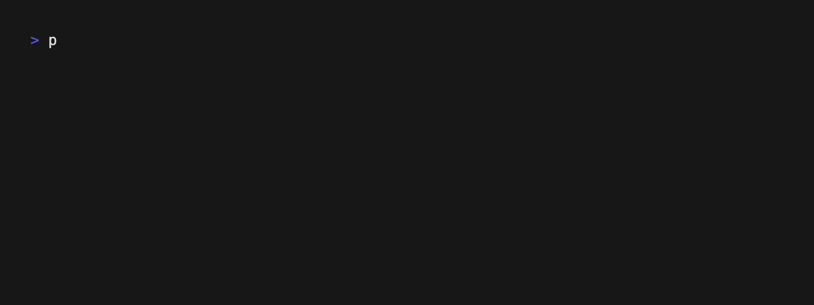

# MultiVolatility (MultiVol)

**A high-performance, containerized memory forensics platform.**

MultiVol orchestrates **Volatility 2** and **Volatility 3** analysis in parallel using Docker. It features a powerful CLI for automation and a modern Web Interface for visualization.




## 📂 Project Structure

- **[CLI/](CLI/)**: The core engine. Python-based CLI that manages Docker containers, processes memory dumps, and exposes a REST API.
    - [Read CLI Documentation](CLI/README.md)
- **[Web/](Web/)**: The frontend interface. React-based Dashboard for managing cases, launching scans, and exploring results (Process Trees, File Browsers).
    - [Read Web Documentation](Web/README.md)

## Quick Start (Docker Compose)

The easiest way to run the full stack (API + Web UI) is using Docker Compose.

1.  **Build the base images:**
    
    Before starting, you must build the Volatility worker images:
    ```bash
    cd CLI
    docker build Dockerfiles/volatility2/ -t volatility2:latest
    docker build Dockerfiles/volatility3/ -t volatility3:latest
    cd ..
    ```

2.  **Launch the platform:**

    ```bash
    docker compose up --build -d
    ```

3.  **Access the UI:**
    Open your browser and navigate to `http://localhost`.

## CLI Usage

If you prefer to use the tool purely from the command line:

```bash
pip install multivol
multivol --help
```

Or install from source:

```bash
cd CLI
pip install .
multivol --help
```

Example:
```bash
multivol vol3 --dump memdump.raw --image volatility3:latest --windows --light
```

## License

This project is licensed under the GNU General Public License v3.0.
