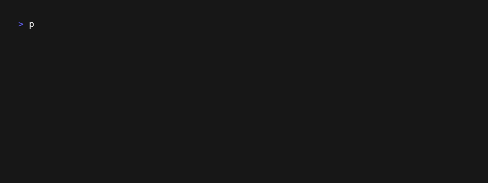
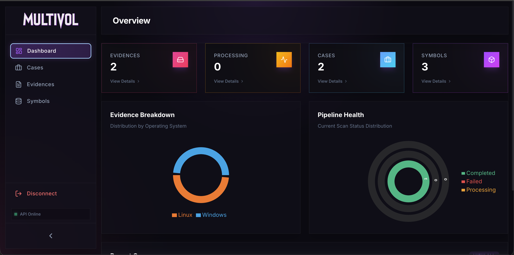

<div align="center">


# MultiVolatility (MultiVol)

**A high-performance, containerized memory forensics platform.**

[](https://pypi.org/project/multivol/)
<br>
[](https://github.com/BoBNewz)
[](https://github.com/Sp00kySkelet0n)

</div>

MultiVol orchestrates **Volatility 2** (WIP) and **Volatility 3** analysis in parallel using Docker. It features a powerful CLI for automation and a modern Web Interface for visualization.




## 📂 Project Structure

- **[CLI/](CLI/)**: The core engine. Python-based CLI that manages Docker containers, processes memory dumps, and exposes a REST API.
    - [Read CLI Documentation](CLI/README.md)
- **[Web/](Web/)**: The frontend interface. React-based Dashboard for managing cases, launching scans, and exploring results (Process Trees, File Browsers).
    - [Read Web Documentation](Web/README.md)

## Quick Start (Docker Compose)

The easiest way to run the full stack (API + Web UI) is using Docker Compose.

> **⚠️ Security notice — keep port 5001 local**
>
> The API on port 5001 uses Docker-outside-of-Docker: the API container can
> create new containers on your host.  Even with the Docker socket proxy in
> place, an authenticated caller can still mount arbitrary host paths into a
> container, which is an irreducible consequence of needing to run scan
> containers dynamically.
>
> **Do not expose port 5001 to any untrusted network.**  If you choose to do
> so anyway, you accept full responsibility for the security implications —
> including the possibility of a privileged host escape.  For local forensic
> work, bind the port to localhost only (`127.0.0.1:5001:5001` in
> `docker-compose.yml`).

1.  **Build the base images:**
    
    Before starting, you must build the Volatility worker images:
    ```bash
    docker build Dockerfiles/volatility2/ -t volatility2:latest
    docker build Dockerfiles/volatility3/ -t volatility3:latest
    ```

2.  **Launch the platform:**

    ```bash
    docker compose up --build -d
    ```

3.  **Access the UI:**
    Open your browser and navigate to `http://localhost`. The password to log in is stored in `Web/.env`.

## CLI Usage

If you prefer to use the tool purely from the command line:

```bash
pip install multivol
multivol --help
```

Or install from source:

```bash
cd CLI
pip install .
multivol --help
```

Example:
```bash
multivol vol3 --dump memdump.raw --image volatility3:latest --windows --light
```

## License

This project is licensed under the GNU General Public License v3.0.
