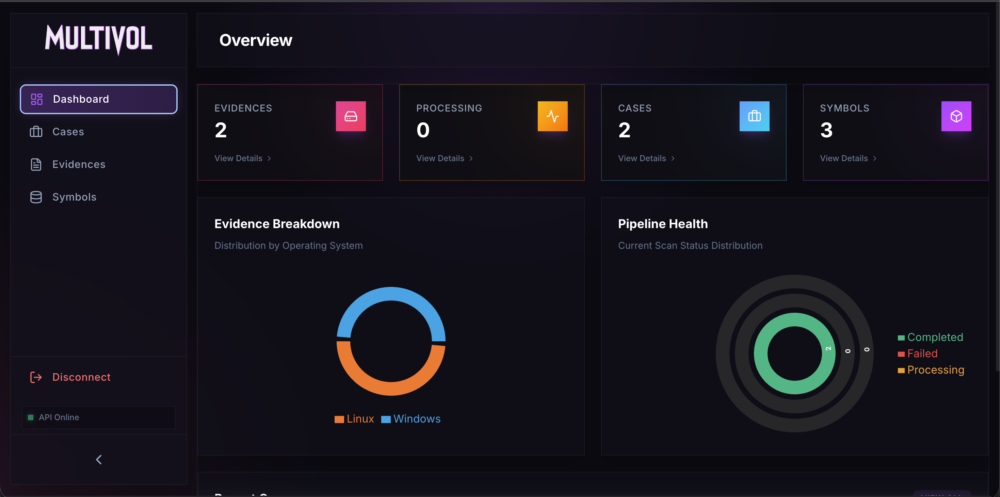

# MultiVol Web Interface



The modern frontend for the MultiVolatility analysis tool. Built with **React 19**, **Vite**, and **TailwindCSS**.

## 🚀 Features

- **Dashboard**: Overview of recent cases and system status.
- **Evidence Locker**: Manage memory dumps and organize them into cases.
- **Scan Configuration**: Launch new scans with Volatility 2 or 3, selecting profiles and plugins.
- **Results Viewer**:
    - **Data Tables**: Searchable and filterable results for plugins like `pslist`, `netscan`, etc.
    - **Process Tree**: Interactive hierarchical view of process parent-child relationships (`pstree`).
    - **File Browser**: Explore the file system structure recovered by `filescan`.
- **Real-time Updates**: Live notifications when modules complete.

## 🛠️ Prerequisites

- **Node.js** (v18 or higher)
- **npm** (included with Node.js)

## 📦 Installation & Setup

1.  **Install dependencies:**

    ```bash
    cd Web
    npm install
    ```

2.  **Start Development Server:**

    ```bash
    npm run dev
    ```

    The app will be available at `http://localhost:5173`.

## 🏗️ Production Build

To build the project for production:

```bash
npm run build
```

This generates static assets in the `dist` directory.

## 🐳 Docker Support

You can run the web interface as a Docker container (recommended for production):

```bash
docker build -t multivol-web .
docker run -p 80:80 multivol-web
```

> **Note:** The web interface expects the MultiVol API to be running on `http://localhost:5001` (default).
